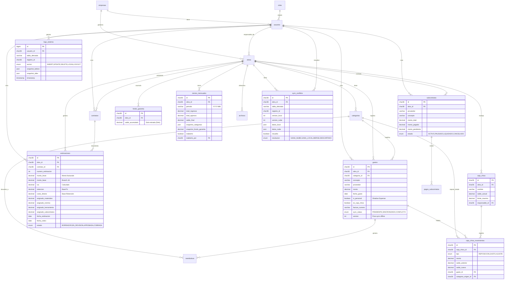

## 📊 Explicación de Relaciones Clave:

### Flujo de Dinero (La Cascada):
```
CLIENTE paga → estimaciones (APROBADA)
    ├─> monto_bruto / 1.16 = monto_base
    ├─> monto_base * %retención → fondo_garantia ✓
    ├─> costo_directo - subcontratos = Base Repartible
    └─> Base Repartible se distribuye a:
        ├─> categorias[MATERIALES] ✓
        ├─> categorias[NOMINA] ✓
        └─> categorias[HERRAMIENTA] ✓

Usuario crea → gastos
    └─> Resta de categorias.saldo_actual (trigger automático)
```

### Multitenancy:
- Todas las tablas transaccionales tienen `obra_id`
- `obras` pertenece a `empresas`
- Filtros automáticos en cada consulta

### Offline-First:
- `gastos.sync_status` controla el estado de sincronización
- `sync_conflicts` almacena colisiones para resolución manual
- `version` permite Operational Transformation

### Auditoría (Caja Negra):
- `logs_sistema` registra TODO (triggers automáticos)
- `snapshot_before` y `snapshot_after` inmutables
- Soft delete en todas las entidades (`deleted_at`)
